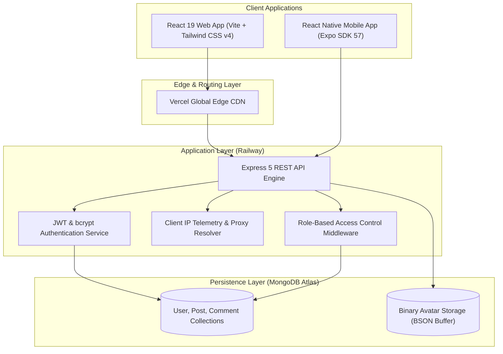

# 🌿 Clearfeed — The Anti-Algorithm Social Platform & Developer Studio

<div align="center">

[](https://clearfeed-web.vercel.app/)
[](https://clearfeed518.up.railway.app)
[](https://react.dev/)
[](https://nodejs.org/)
[](https://www.mongodb.com/)
[](LICENSE)

**"Unfiltered. Chronological. Yours."**  
A high-performance full-stack social network and developer code studio engineered for thinkers, writers, and software engineers. Free from engagement manipulation, vanity algorithmic feeds, and tracking surveillance.

[**Explore Live Web Application »**](https://clearfeed-web.vercel.app/) · [Report Bug](https://github.com/Nasir-Yousuf/social-media-application/issues) · [Request Feature](https://github.com/Nasir-Yousuf/social-media-application/issues)

</div>

---

## 📑 Table of Contents

- [Executive Summary](#-executive-summary)
- [System Architecture](#-system-architecture)
- [Key Engineering Highlights](#-key-engineering-highlights)
- [Core Features](#-core-features)
- [Tech Stack](#-tech-stack)
- [API Architecture](#-api-architecture)
- [Zero-Cloud-Cost Storage Engine](#-zero-cloud-cost-storage-engine)
- [Security & Administrative Governance](#-security--administrative-governance)
- [Mobile Application (React Native + Expo)](#-mobile-application-react-native--expo)
- [Local Development & Setup](#-local-development--setup)
- [Cloud Deployment Guide](#-cloud-deployment-guide)
- [Engineering Decisions & Trade-Offs](#-engineering-decisions--trade-offs)
- [Authors & Core Maintainers](#-authors--core-maintainers)

---

## 💡 Executive Summary

Modern social networks are architected around algorithmic feedback loops, outrage amplification, and opaque ranking signals designed to maximize screen time rather than substantive discourse.

**Clearfeed** re-engineers social interaction from first principles:

- **Strictly Chronological Timeline**: Posts appear in the exact order they are created. No shadow-boosting, no engagement downranking.
- **Developer First**: Native **VS Code-styled Multi-File CodeHub Studio** for sharing, inspecting, and 1-click remixing real codebases alongside technical discussions.
- **Zero-Cloud-Cost Scalability**: Engineered with custom client-side HTML5 canvas compression and MongoDB binary stream avatars, eliminating AWS S3/Cloudinary monthly billing.
- **Enterprise-Grade Governance**: Multi-tenant role-based access control (RBAC), multi-maintainer protection, reverse-proxy-aware client IP telemetry, and active audit logging.

---

## 🏗️ System Architecture



---

## ⚡ Key Engineering Highlights

| Highlight                            | Description                                                                                                                                       |
| :----------------------------------- | :------------------------------------------------------------------------------------------------------------------------------------------------ |
| **Full-Stack Reactive Architecture** | Built with **React 19**, **Express 5**, and **Mongoose 8** with full end-to-end type safety, modern async middleware, and optimistic UI updates.  |
| **Client-Side Image Pre-Processing** | Canvas-based downscaling resizes profile photos to 128×128 JPEG at ≤100KB before transmission, reducing network payload by ~95%.                  |
| **Reverse-Proxy-Aware IP Telemetry** | Extracts and normalizes genuine client IP addresses through Cloudflare, Vercel, and Railway headers (`CF-Connecting-IP`, `X-Forwarded-For`).      |
| **Maintainer Governance Safeguards** | Designated site maintainers are cryptographically shielded from unauthorized role changes, suspension, or deletion. |
| **Mobile Parity**                    | Standalone iOS & Android application built with React Native and Expo featuring Twitter's "Lights Out" design system and native gesture handling. |

---

## 🌟 Core Features

### 1. 🌿 The Chronological Feed & Calm Reading Experience

- **Pure Chronology**: Guaranteed time-ordered feed with an explicit "No Algorithm" banner.
- **Substance-Over-Soundbites**: 2,000-character thoughtful limit rendered with custom serif typography (`Source Serif 4`) for distraction-free reading.
- **Anti-Doomscrolling**: Deliberate pagination buttons instead of infinite scroll traps.
- **Quiet Engagements**: Appreciate, Respond, Bookmark, and Share without performative metrics.

### 2. 💻 Multi-File CodeHub Studio

- **VS Code Interface**: Tabbed file switcher mirroring the IDE experience with syntax highlighting and file-type icons.
- **Multi-File Projects**: Share HTML, CSS, JavaScript, TypeScript, Python, SQL, and React components in a single post.
- **1-Click Remix & Fork**: Clone any shared code snippet directly into your composer with automatic author attribution.

### 3. 🛡️ Administrative Governance & Security Dashboard

- **Role-Based Access Control**: Instant permission toggles (`admin` vs. `student`/member).
- **Live Traffic & IP Audit Logs**: Real-time inspection of IP addresses attached to registrations, logins, posts, and comments.
- **Platform Integrity**: Post deletion across the network, user suspension controls, and site-wide announcement broadcasts.
- **Maintainer Safeguards**: Primary platform maintainers hold non-demotable administrative status to protect application infrastructure.

### 4. 🔖 Personal Knowledge Base & Bookmarks

- Privately bookmark posts, technical guides, and code snippets to `/bookmarks`.
- Instant search and filtering across saved entries.

### 5. 👥 Community Directory & Member Profiles

- Public profiles displaying user bio, technical interests, role badges, and custom status lines (e.g. `🔨 Building a compiler`).
- Community directory with real-time search and role filtering.

---

## 🛠️ Tech Stack

### Web Frontend

- **Framework**: [React 19](https://react.dev/) + [Vite 8](https://vitejs.dev/)
- **Styling**: [Tailwind CSS v4](https://tailwindcss.com/) + Custom CSS Design System Tokens
- **Icons**: [Lucide React](https://lucide.dev/)
- **Date Handling**: [Date-fns](https://date-fns.org/)
- **Routing**: [React Router DOM v7](https://reactrouter.com/)
- **Deployment**: [Vercel](https://vercel.com/) Edge Network

### Backend API

- **Runtime**: [Node.js](https://nodejs.org/) (ES Modules & CommonJS compatibility)
- **Web Framework**: [Express 5](https://expressjs.com/)
- **Database ODM**: [Mongoose 8](https://mongoosejs.com/)
- **Authentication**: Stateless JSON Web Tokens ([jsonwebtoken](https://github.com/auth0/node-jsonwebtoken)) + [bcryptjs](https://github.com/dcodeIO/bcrypt.js)
- **Security & Logging**: Custom IP middleware, CORS configuration, Morgan HTTP request logger
- **Deployment**: [Railway](https://railway.app/) PaaS

### Database

- **Primary Database**: [MongoDB Atlas](https://www.mongodb.com/atlas) (M0 Free Tier)
- **Local Fallback**: Embedded `mongodb-memory-server` for instant offline zero-config development

### Mobile Application (`mobile/`)

- **Framework**: [React Native 0.86](https://reactnative.dev/)
- **Tooling**: [Expo SDK 57](https://expo.dev/)
- **Navigation**: React Navigation v7 (Bottom Tabs & Native Stack)
- **Storage**: AsyncStorage for offline persistence

---

## 🔌 API Architecture

| Endpoint                      |  Method  |     Access     | Description                                       |
| :---------------------------- | :------: | :------------: | :------------------------------------------------ |
| `/api/auth/register`          |  `POST`  |     Public     | Register new member with client IP tracking       |
| `/api/auth/login`             |  `POST`  |     Public     | Authenticate user, update session IP, return JWT  |
| `/api/auth/me`                |  `GET`   |    Private     | Retrieve authenticated profile and refresh roles  |
| `/api/posts`                  |  `GET`   |     Public     | Fetch chronological posts with pagination         |
| `/api/posts`                  |  `POST`  |    Private     | Create text/code post with IP attribution         |
| `/api/posts/:id`              | `DELETE` | Author / Admin | Remove post and cascade delete comments           |
| `/api/posts/:id/comments`     |  `POST`  |    Private     | Add comment with IP tracking                      |
| `/api/users/:id/avatar`       |  `GET`   |     Public     | Stream binary avatar buffer with HTTP caching     |
| `/api/users/:id/avatar`       |  `PUT`   |    Private     | Upload compressed JPEG avatar buffer              |
| `/api/admin/users`            |  `GET`   |     Admin      | Fetch user directory with IP audit data           |
| `/api/admin/traffic`          |  `GET`   |     Admin      | Stream live IP traffic and security events        |
| `/api/admin/users/:id/role`   | `PATCH`  |     Admin      | Toggle admin status (protected against co-admins) |
| `/api/admin/users/:id/status` | `PATCH`  |     Admin      | Toggle account suspension                         |

---

## 💾 Zero-Cloud-Cost Storage Engine

Standard web applications often rely on paid third-party asset storage services like Amazon S3 or Cloudinary. Clearfeed completely avoids recurring infrastructure bills through an efficient binary buffer pipeline:

1. **Client-Side Compression**: The browser or mobile app utilizes an HTML5 Canvas to downscale uploaded images to 128×128 JPEG (quality ~0.8), guaranteeing file sizes stay ≤ 100 KB.
2. **Direct BSON Binary Storage**: The binary buffer is uploaded directly via Express and saved into the user's MongoDB document (`avatarData: Buffer`, `avatarMimeType: String`).
3. **Optimized Delivery**: Avatars are served through `GET /api/users/:id/avatar` with:
   - `Cache-Control: public, max-age=86400, stale-while-revalidate=43200`
   - Automated HTTP `304 Not Modified` handling.
4. **Capacity**: Over **5,000 active avatars** can comfortably fit within MongoDB Atlas’s free 512 MB tier.

---

## 🛡️ Security & Administrative Governance

- **Multi-Proxy IP Telemetry**: Real-world web traffic routes through reverse proxies (Vercel, Cloudflare, Railway). Clearfeed implements a robust IP resolver:
  ```javascript
  const getClientIp = (req) => {
    const forwarded = req.headers["x-forwarded-for"];
    if (forwarded) return forwarded.split(",")[0].trim();
    return (
      req.headers["cf-connecting-ip"] ||
      req.socket?.remoteAddress ||
      "127.0.0.1"
    );
  };
  ```
- **Maintainer Safeguards**: Primary platform maintainers possess immutable administrative rights in the backend controllers, preventing accidental demotion, suspension, or deletion.
- **Strict Role-Based Middleware**: Sensitive administrative endpoints require verified JWT authentication and validated `role === 'admin'`.

---

## 📱 Mobile Application (React Native + Expo)

Clearfeed includes a native mobile client in the [`mobile/`](./mobile) directory.

### Key Mobile Features:

- **Twitter "Lights Out" Aesthetic**: Deep AMOLED black `#000000`, surface card `#16181c`, borders `#2f3336`, and Twitter blue `#1d9bf0`.
- **VS Code CodeBlock Component**: Multi-file tabbed code viewer with line numbers and 1-tap copy to clipboard via `expo-clipboard`.
- **Gesture-Driven UX**: Pull-to-refresh (`RefreshControl`), smooth tab switching, and native OS share sheets.
- **Configurable Backend Target**: 1-tap host switcher to seamlessly toggle between production (`clearfeed518.up.railway.app`), local Wi-Fi, or Android emulator (`10.0.2.2`).

```bash
# Start Expo development server:
npm run mobile
# or
cd mobile && npm start
```

---

## 🚀 Local Development & Setup

### Prerequisites

- **Node.js**: v18.0.0 or higher
- **npm**: v9.0.0 or higher
- **Git**

### Installation

1. **Clone the repository:**

   ```bash
   git clone https://github.com/Nasir-Yousuf/social-media-application.git
   cd social-media-application
   ```

2. **Install all dependencies:**

   ```bash
   npm run install:all
   ```

3. **Start Development Servers:**

   ```bash
   npm run dev
   ```

   _This starts both the backend API (port 5180) and frontend Vite dev server (port 5173)._

4. **Access the Application:**
   Open [http://localhost:5173](http://localhost:5173) in your browser.

---

## 🌐 Cloud Deployment Guide

Clearfeed is pre-configured for frictionless zero-cost deployment across standard cloud providers:

| Layer        | Host                                      | Configuration                                            |
| :----------- | :---------------------------------------- | :------------------------------------------------------- |
| **Frontend** | [Vercel](https://vercel.com/)             | Root: `client` · Build: `npm run build` · Output: `dist` |
| **Backend**  | [Railway](https://railway.app/)           | Root: `server` · Start: `node server.js`                 |
| **Database** | [MongoDB Atlas](https://www.mongodb.com/) | Free M0 Cluster (512 MB storage)                         |

### Environment Variables

**Backend (`server/.env`):**

```env
PORT=5180
NODE_ENV=production
MONGODB_URI=mongodb+srv://<user>:<password>@cluster.mongodb.net/clearfeed
JWT_SECRET=your_super_secret_jwt_key
```

**Frontend (`client/.env`):**

```env
VITE_API_URL=https://clearfeed518.up.railway.app
```

---

## ⚖️ Engineering Decisions & Trade-Offs

1. **In-Database Binary Avatars vs. AWS S3**:
   - _Decision_: Stored compressed avatars directly in MongoDB Atlas.
   - _Rationale_: Eliminates third-party billing and AWS IAM credential management for a zero-cost portfolio architecture. Canvas downscaling caps file sizes at ≤100 KB, preventing database bloat.
2. **Chronological Deliberate Pagination vs. Infinite Scroll**:
   - _Decision_: Implemented explicit "Load earlier posts" buttons over automated infinite scroll listeners.
   - _Rationale_: Respects user agency and aligns with the anti-doomscrolling philosophy while simplifying client-side virtualization requirements.
3. **Stateless JWT vs. Stateful Sessions**:
   - _Decision_: Issued stateless 7-day JWT tokens stored in browser `localStorage`.
   - _Rationale_: Reduces server memory overhead, decouples horizontal scaling on Railway, and simplifies cross-origin requests between Vercel and Railway.

---

## 👤 Author & Maintainer

- **Nasir Yousuf** — Founder & Lead Developer
  - GitHub: [@Nasir-Yousuf](https://github.com/Nasir-Yousuf)
  - Clearfeed: `@nasir`

---

## 📄 License

This project is licensed under the [MIT License](LICENSE) — feel free to explore, fork, and build upon it.
