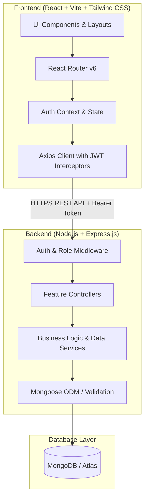
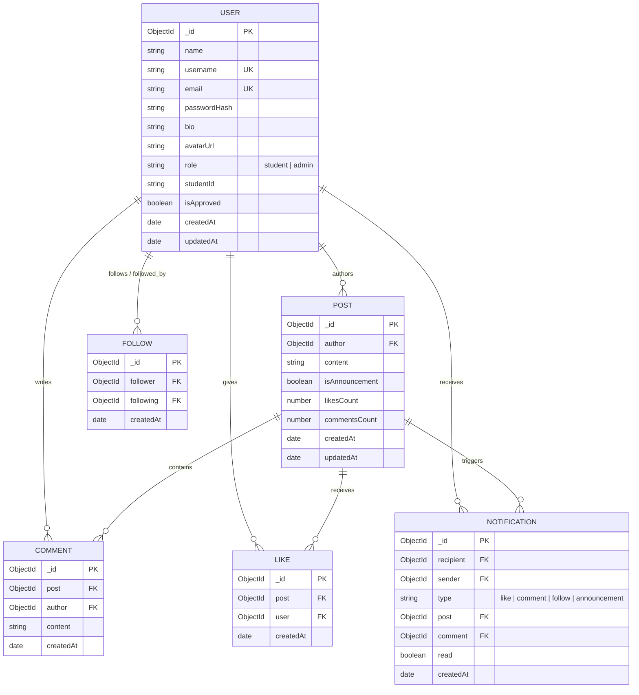

# Course Social Media Platform (Pulse518) — Architecture & Technical Specification

## 1. Project Overview & Product Vision

**Pulse518** is a private, cohort-exclusive social network engineered specifically for a class of ~35 students (with an extensible architecture capable of scaling to hundreds). Inspired by the fast, text-first clarity of classic Twitter, Pulse518 departs from generic corporate dashboards to deliver a focused academic community experience.

### Core Distinctions

- **Academic Context:** Course announcements, pinned syllabus highlights, student study groups, and peer Q&A alongside casual text posts.
- **Privacy by Default:** Enclosed ecosystem. Only verified course members (via a secure course enrollment passcode or instructor invitation) can register, read, or post.
- **Frictionless Text-First Feed:** Fast micro-posts (280 characters), threaded discussions, optimistic like interactions, and real-time community engagement.
- **Role-Based Governance:** Faculty/Instructor (Admin) tools for moderation, student roster auditing, and announcements.

---

## 2. System Architecture



---

## 3. Database Schema & Relational Design

Using **MongoDB with Mongoose**, we balance relational integrity with document speed.



### Key Indexing & Constraints

- `LIKE`: Compound unique index on `{ post: 1, user: 1 }` guarantees that a user cannot like the same post more than once.
- `FOLLOW`: Compound unique index on `{ follower: 1, following: 1 }` prevents duplicate follow edges. Self-following is validated and rejected at the service layer.
- `POST`: Indexes on `{ createdAt: -1 }` and `{ author: 1, createdAt: -1 }` for low-latency chronological feed queries.
- `USER`: Unique sparse indexes on `username` (lowercase) and `email` (lowercase).

---

## 4. RESTful API Specification

All protected endpoints require an `Authorization: Bearer <token>` header.

### 4.1 Authentication (`/api/auth`)

| Method | Endpoint             | Description                                        | Auth Required |
| ------ | -------------------- | -------------------------------------------------- | ------------- |
| `POST` | `/api/auth/register` | Register student with course passcode verification | Public        |
| `POST` | `/api/auth/login`    | Login with username/email & password; returns JWT  | Public        |
| `GET`  | `/api/auth/me`       | Fetch authenticated user profile and stats         | Required      |
| `POST` | `/api/auth/logout`   | Client token invalidation / logout acknowledgment  | Required      |

### 4.2 Users & Profiles (`/api/users`)

| Method   | Endpoint                       | Description                                                    | Auth Required   |
| -------- | ------------------------------ | -------------------------------------------------------------- | --------------- |
| `GET`    | `/api/users/profile/:username` | Retrieve public profile, follower/following counts, post count | Required        |
| `PATCH`  | `/api/users/profile`           | Update own profile (name, bio, avatar)                         | Required (Self) |
| `POST`   | `/api/users/:id/follow`        | Follow a classmate                                             | Required        |
| `DELETE` | `/api/users/:id/follow`        | Unfollow a classmate                                           | Required        |
| `GET`    | `/api/users/:id/followers`     | List user's followers                                          | Required        |
| `GET`    | `/api/users/:id/following`     | List users followed                                            | Required        |
| `GET`    | `/api/users/directory`         | Roster of all course members (~35 cohort members)              | Required        |
| `GET`    | `/api/users/suggestions`       | Suggested classmates to follow                                 | Required        |

### 4.3 Posts & Feed (`/api/posts`)

| Method   | Endpoint                    | Description                                               | Auth Required             |
| -------- | --------------------------- | --------------------------------------------------------- | ------------------------- |
| `GET`    | `/api/posts/feed`           | Personalized feed: tab=all (course wide) or tab=following | Required                  |
| `POST`   | `/api/posts`                | Create new post (280 char limit validation)               | Required                  |
| `GET`    | `/api/posts/:id`            | Get single post details with comments                     | Required                  |
| `PATCH`  | `/api/posts/:id`            | Edit own post                                             | Required (Owner)          |
| `DELETE` | `/api/posts/:id`            | Delete post                                               | Required (Owner or Admin) |
| `GET`    | `/api/posts/user/:username` | Get all posts by a specific user                          | Required                  |
| `GET`    | `/api/posts/explore`        | Popular and trending course posts                         | Required                  |
| `GET`    | `/api/posts/code-snippets`   | Filterable code snippets feed (by language & search)      | Required                  |

### 4.4 Interactions: Likes & Comments (`/api/posts/:id/...`)

| Method   | Endpoint                   | Description                                  | Auth Required             |
| -------- | -------------------------- | -------------------------------------------- | ------------------------- |
| `POST`   | `/api/posts/:id/like`      | Toggle like (optimistic return of new state) | Required                  |
| `GET`    | `/api/posts/:id/comments`  | Retrieve post comments thread                | Required                  |
| `POST`   | `/api/posts/:id/comments`  | Create comment on a post                     | Required                  |
| `DELETE` | `/api/comments/:commentId` | Delete comment                               | Required (Owner or Admin) |

### 4.5 Notifications (`/api/notifications`)

| Method  | Endpoint                          | Description                                | Auth Required |
| ------- | --------------------------------- | ------------------------------------------ | ------------- |
| `GET`   | `/api/notifications`              | Get user notifications list                | Required      |
| `PATCH` | `/api/notifications/mark-read`    | Mark all or specific notifications as read | Required      |
| `GET`   | `/api/notifications/unread-count` | Get unread count badge                     | Required      |

### 4.6 Search (`/api/search`)

| Method | Endpoint                | Description                                | Auth Required |
| ------ | ----------------------- | ------------------------------------------ | ------------- |
| `GET`  | `/api/search?q={query}` | Search posts, student names, and usernames | Required      |

### 4.7 Administration (`/api/admin`)

| Method   | Endpoint                    | Description                                              | Auth Required |
| -------- | --------------------------- | -------------------------------------------------------- | ------------- |
| `GET`    | `/api/admin/overview`       | Platform statistics (total posts, active students, etc.) | Admin Only    |
| `GET`    | `/api/admin/users`          | List and manage student accounts                         | Admin Only    |
| `PATCH`  | `/api/admin/users/:id/role` | Promote to admin or toggle account status                | Admin Only    |
| `DELETE` | `/api/admin/posts/:id`      | Moderation: force-delete inappropriate post              | Admin Only    |
| `POST`   | `/api/admin/announcement`   | Publish official course announcement                     | Admin Only    |

---

## 5. Frontend Routes & Layout Architecture

```
/
├── /login (Public)
├── /register (Public, requires course passkey)
└── AppLayout (Protected)
    ├── / or /home (Main Feed: 'For You' / 'Following' tabs + Composer)
    ├── /explore (Course trends, active members, popular posts)
    ├── /code (Code Hub: share, filter, and copy course code snippets)
    ├── /notifications (Notification center with activity badges)
    ├── /members (Course Member Directory: ~35 students list & status)
    ├── /bookmarks (Saved reference posts)
    ├── /search (Unified search interface)
    ├── /profile/:username (Student Profile, Posts tab, Likes tab)
    ├── /settings (Account settings & theme preferences)
    └── /admin (Faculty moderation dashboard, restricted to role: 'admin')
```

### Layout Composition (Desktop & Mobile)

- **Desktop (3 Columns):**
  - **Left Sidebar:** Logo (`Pulse518`), Navigation items with live badge counts, "New Post" primary action, Student profile pill + quick logout.
  - **Main Feed Column:** Feed header with tab switcher ("Course Feed" / "Following"), sticky Composer ("What are you studying or building?"), post stream with infinite scroll / load more.
  - **Right Sidebar:** Course Meta Card ("CS-518: Web Architecture", 35 Enrolled, 1 Instructor), Classmate Suggestions ("Classmates to connect with"), and Search bar.
- **Mobile (< 768px):**
  - Top AppBar with Course branding and profile avatar drawer.
  - Bottom Tab Bar for Home, Explore, Notifications, Members, and FAB for New Post modal.

---

## 6. Security Analysis & Threat Mitigation

| Threat                                      | Impact                                           | Technical Mitigation                                                                           |
| ------------------------------------------- | ------------------------------------------------ | ---------------------------------------------------------------------------------------------- | --- | ---------------------------- |
| **Unauthorized Public Access**              | Strangers browsing private student discussions   | Mandatory enrollment code on signup + closed route guards on both API and UI.                  |
| **Plaintext Password Leakage**              | Compromised credentials                          | `bcryptjs` with salt work factor of 12; passwords stripped from all user projections.          |
| **IDOR (Insecure Direct Object Reference)** | Students editing or deleting peer posts/comments | Controller authorization checks (`post.author.equals(req.user.\_id)                            |     | req.user.role === 'admin'`). |
| **XSS (Cross-Site Scripting)**              | Malicious scripts injected into post body        | Sanitization of post content + standard React JSX text node escaping.                          |
| **Brute Force & Flooding**                  | Spamming endpoints or login attacks              | `express-rate-limit` on auth and post creation endpoints.                                      |
| **Token Tampering / Hijacking**             | Forged identities                                | Cryptographically signed JWTs with expiration; verified via middleware on every private route. |

---

## 7. Phased Implementation Roadmap

1. **Phase 1: Foundation & Infrastructure**
   - Initialize monorepo structure (`client/` and `server/`).
   - Configure Express server, MongoDB connectivity, Mongoose models, and seeding mechanism with ~35 realistic course members.
   - Implement Auth API (Registration with course code, Login, JWT verification).
   - Setup React frontend with Tailwind CSS, Lucide icons, Auth Context, and Protected Route wrappers.

2. **Phase 2: Core Social Feed & Post Creation**
   - Post composer with character limit ring, validation, and optimistic posting.
   - Feed rendering with responsive cards, author avatars, and timestamps.
   - Post editing and deletion with permission guards.
   - Atomic Like/Unlike system with heart animation and instant count sync.

3. **Phase 3: Comments & Social Graph**
   - Threaded post comments drawer / expander.
   - Follow / Unfollow relationships and dynamic follower/following counters.
   - Dual-tab feed algorithm ("Course Feed" vs "Following").

4. **Phase 4: Community, Discovery & Notifications**
   - Notification triggers (on like, comment, follow, announcement).
   - Course Member Directory (~35 cohort roster with filter by role/status).
   - Explore page with course discussions and trending tags.
   - Unified search for classmates and discussions.

5. **Phase 5: Faculty Admin & Moderation**
   - Admin panel with platform metrics.
   - Student roster management (role toggling, member moderation).
   - Course announcements with distinct visual badge.

6. **Phase 6: Polish, Testing & Aesthetics**
   - Responsive verification across mobile, tablet, and desktop.
   - Micro-interactions, empty states, and toast notifications.
   - Comprehensive end-to-end verification.
